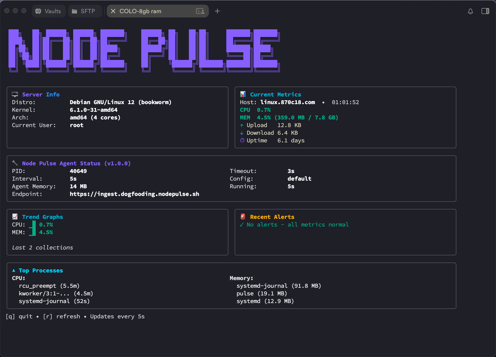

# NodePulse Agent

A lightweight, self-contained monitoring agent written in Go. It collects system metrics (CPU, memory, network I/O, and uptime) and reports them to your NodePulse control server via HTTP.

**Lightweight & Efficient:**

- Single binary, <15 MB
- <40 MB RAM usage
- Real-time metrics with configurable intervals (5s to 1m)

## Features

- **Real-time Metrics**: CPU usage, memory usage, network I/O, and system uptime
- **Configurable Intervals**: 5s, 10s, 30s, or 1 minute collection intervals
- **Reliable Delivery**: HTTP-based reporting with automatic buffering on failure
- **Smart Buffering**: Failed reports are stored in hourly JSONL files (48-hour retention)
- **Service Management**: Easy systemd service installation and management
- **Live View**: Built-in TUI for viewing metrics in real-time
- **Cross-Platform**: Builds for both amd64 and arm64 architectures

## Screenshots

### Real-time Metrics ( run `pulse watch`)



## Installation

### From Binary

Download the latest release for your architecture:

```bash
# For amd64
wget https://github.com/node-pulse/agent/releases/latest/download/pulse-linux-amd64.tar.gz
tar -xzf pulse-linux-amd64.tar.gz
sudo mv pulse /usr/local/bin/

# For arm64
wget https://github.com/node-pulse/agent/releases/latest/download/pulse-linux-arm64.tar.gz
tar -xzf pulse-linux-arm64.tar.gz
sudo mv pulse /usr/local/bin/
```

### From Source

```bash
git clone https://github.com/node-pulse/agent.git
cd agent
go build -o pulse
sudo mv pulse /usr/local/bin/
```

## Configuration

Create a configuration file at `/etc/node-pulse/nodepulse.yml`:

```yaml
server:
  endpoint: "https://api.nodepulse.io/metrics"
  timeout: 3s

agent:
  server_id: "your-unique-uuid-here" # Required: UUID to identify this server
  interval: 5s # Options: 5s, 10s, 30s, 1m

buffer:
  enabled: true
  path: "/var/lib/node-pulse/buffer"
  retention_hours: 48
```

**Server ID Generation & Persistence**:

The server ID uniquely identifies your server in the NodePulse system. The agent handles this automatically:

- If you leave `server_id` as the placeholder or omit it, the agent will **auto-generate** a UUID on first run
- The generated UUID is automatically persisted to disk at the first writable location (in order):
  1. `/var/lib/node-pulse/server_id` (preferred for system-wide installations)
  2. `/etc/node-pulse/server_id` (alternative system location)
  3. `~/.node-pulse/server_id` (user home directory)
  4. `./server_id` (fallback to current directory)
- The same UUID will be reused on subsequent runs, even if you don't set it in the config
- The persisted ID takes precedence over the config file to maintain consistency
- You can check where your server ID is stored with: `pulse status`
- You can also manually set a UUID in the config if you prefer:
  - Linux/Mac: `uuidgen`
  - PowerShell: `New-Guid`

Or use the included `nodepulse.yml` as a template:

```bash
sudo mkdir -p /etc/node-pulse
sudo cp nodepulse.yml /etc/node-pulse/
sudo nano /etc/node-pulse/nodepulse.yml  # Edit your endpoint
```

## Usage

### Initialize Configuration (First Time Setup)

```bash
sudo pulse init
```

Interactive setup wizard that:
- Creates necessary directories (`/etc/node-pulse`, `/var/lib/node-pulse`)
- Generates and persists server ID
- Creates configuration file with your settings
- Guides you through endpoint and interval configuration

Use `--yes` flag for quick mode with defaults.

### Run Agent in Foreground

```bash
pulse agent
```

### Watch Live Metrics

```bash
pulse watch
```

Press `q` to quit the live view.

### Check Agent Status

```bash
pulse status
```

Shows comprehensive agent status including server ID, configuration, service status, buffer state, and logging.

**Example output:**

```
Node Pulse Agent Status
=====================

Server ID:     a1b2c3d4-e5f6-7890-abcd-ef1234567890
Persisted at:  /var/lib/node-pulse/server_id

Config File:   /etc/node-pulse/nodepulse.yml
Endpoint:      https://api.nodepulse.io/metrics
Interval:      5s

Agent:         running (via systemd)

Buffer:        3 report(s) pending in /var/lib/node-pulse/buffer

Log File:      /var/log/node-pulse/agent.log
```

### Service Management

#### Install as systemd service

```bash
sudo pulse service install
```

#### Start the service

```bash
sudo pulse service start
```

#### Check service status

```bash
sudo pulse service status
```

#### Stop the service

```bash
sudo pulse service stop
```

#### Restart the service

```bash
sudo pulse service restart
```

#### Uninstall the service

```bash
sudo pulse service uninstall
```

## Metrics Collected

### System Information (Static)

- Hostname
- Kernel name and version (from `/proc/version`)
- Linux distribution and version (from `/etc/os-release`)
- Architecture (amd64, arm64)
- CPU core count

**Note**: System info is collected once at startup and cached (doesn't change).

### CPU

- Usage percentage (calculated from `/proc/stat`)

### Memory

- Used MB
- Total MB
- Usage percentage (calculated from `/proc/meminfo`)

### Network

- Upload bytes (delta since last collection)
- Download bytes (delta since last collection)
- Collected from `/proc/net/dev` (excludes loopback interface)

### Uptime

- System uptime in days (from `/proc/uptime`)

## JSON Report Format

```json
{
  "timestamp": "2025-10-13T14:30:00Z",
  "server_id": "a1b2c3d4-e5f6-7890-abcd-ef1234567890",
  "hostname": "server-01",
  "system_info": {
    "hostname": "server-01",
    "kernel": "Linux",
    "kernel_version": "5.15.0-89-generic",
    "distro": "Ubuntu",
    "distro_version": "22.04.3 LTS (Jammy Jellyfish)",
    "architecture": "amd64",
    "cpu_cores": 8
  },
  "cpu": {
    "usage_percent": 45.2
  },
  "memory": {
    "used_mb": 2048,
    "total_mb": 8192,
    "usage_percent": 25.0
  },
  "network": {
    "upload_bytes": 1024000,
    "download_bytes": 2048000
  },
  "uptime": {
    "days": 15.5
  }
}
```

**Note**: `system_info` is collected once at startup and cached. It contains static system information that doesn't change during runtime.

If a metric fails to collect, it will be `null`:

```json
{
  "timestamp": "2025-10-13T14:30:00Z",
  "hostname": "server-01",
  "cpu": null,
  "memory": { ... },
  "network": { ... },
  "uptime": { ... }
}
```

## Buffering Behavior

When HTTP reporting fails (timeout or error):

1. The report is appended to an hourly JSONL file in the buffer directory
2. Format: `/var/lib/node-pulse/buffer/2025-10-13-14.jsonl`
3. On next successful send, buffered reports are flushed in background:
   - Processes files oldest-first (chronological order)
   - Sends all reports from a file
   - Only deletes the file after ALL reports are successfully sent
   - If connection fails mid-flush, remaining files are kept for next retry
4. Files older than 48 hours are automatically deleted during cleanup

## Building

### Using Makefile (Recommended)

```bash
# Build for current platform
make build

# Build for all Linux platforms (amd64 + arm64)
make build-all

# Binaries will be in build/ directory
```

### Build for all platforms using GoReleaser

```bash
# Install goreleaser
go install github.com/goreleaser/goreleaser/v2@latest

# Build snapshot (for testing)
make release

# Binaries will be in dist/ directory
```

### Manual compilation

```bash
# For current platform (outputs to build/)
make build

# Or using go directly
go build -o build/pulse .

# For Linux amd64
make build-linux-amd64

# For Linux arm64
make build-linux-arm64
```

## Requirements

- **OS**: Linux (uses `/proc` filesystem)
- **Architectures**: amd64, arm64
- **Permissions**:
  - Normal user for `pulse agent` and `pulse watch`
  - Root (sudo) for `pulse service` commands

## Development

### Project Structure

```
agent/
├── cmd/                  # CLI commands
│   ├── root.go          # Root command
│   ├── agent.go         # Agent runner
│   ├── watch.go         # TUI watch
│   └── service.go       # Service management
├── internal/
│   ├── metrics/         # Metrics collection
│   │   ├── cpu.go
│   │   ├── memory.go
│   │   ├── network.go
│   │   ├── uptime.go
│   │   └── report.go
│   ├── report/          # HTTP sender & buffer
│   │   ├── sender.go
│   │   └── buffer.go
│   └── config/          # Configuration
│       └── config.go
├── .goreleaser.yaml     # Release config
├── nodepulse.yml        # Default config
└── main.go
```

### Testing

The agent needs to run on a Linux system to collect metrics. You can test locally:

```bash
# Run directly with go
go run . agent

# Or build and run
make build
./build/pulse agent
```

View metrics in another terminal:

```bash
./build/pulse watch
```

## License

[MIT](LICENSE)

## Contributing

Contributions are welcome! Please open an issue or submit a pull request.

## Support

For issues and questions, please open an issue on GitHub:
https://github.com/node-pulse/agent/issues
